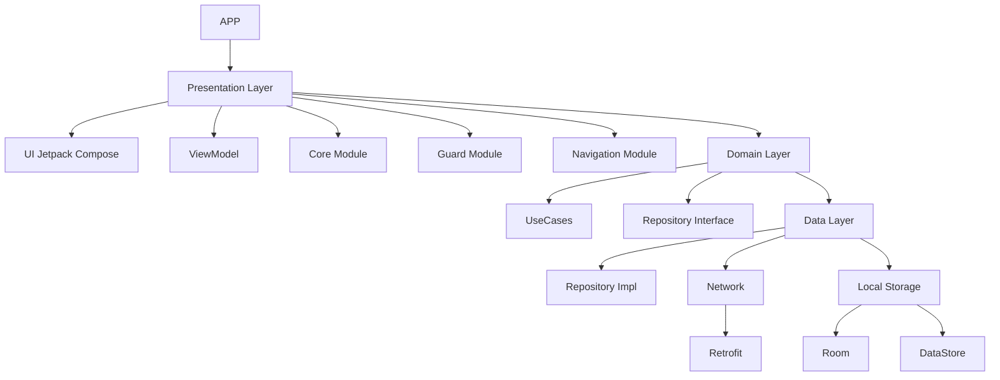

# 🧩 ComposeBase-Multi-Module

A modern, scalable Android project template using **Jetpack Compose**, **Multi-Module Architecture**, and **Clean Architecture** principles.

---

## 🔍 Overview

This project is structured following Clean Architecture, emphasizing modularity and maintainability. It separates concerns into three main layers:

- **Presentation**: UI layer using Jetpack Compose
- **Domain**: Business logic with UseCases and Entities
- **Data**: Handles networking and local data access

---

## 📦 Modules

The project is split into multiple Gradle modules:

- `:app`: Entry point
- `:core`: Reusable UI components, theming, and shared utilities
- `:domain`: UseCases and core business logic
- `:data`: Repositories and data mapping
- `:network`: Retrofit, OkHttp, and API services
- `:room`: Local Room database setup
- `:local`: DataStore and shared preferences
- `:guard`: Error and exception management
- `:navigation`: Centralized Compose navigation

---

## 🎨 UI with Jetpack Compose

- Declarative UI with Jetpack Compose
- State hoisting and unidirectional data flow
- Material3 design with custom theming
- Shared composables for common UI elements (buttons, inputs, etc.)

---

## 🌐 API Handler

- **Retrofit** for HTTP communication
- **OkHttp Interceptors** for logging and headers
- API responses wrapped in sealed classes (`Result`, `Resource`) for consistent error and state handling

---

## ❌ Exception Handling

- Centralized error management in the `:guard` module
- Custom exception classes and mappers
- Domain-level error handling using `try-catch` and `sealed classes`

---

## 🗃️ Local Data Handling

- **Room** for structured local database
- **DataStore** for preferences and key-value storage
- Repository pattern abstracts access to local/network data

---

## 🧪 Testing

- Unit testing with JUnit and MockK/Mockito
- UI testing using Compose Test APIs
- Testable architecture via DI and use case isolation

---

## 🧰 Additional Techniques

- **Hilt** for dependency injection
- **Compose Navigation** with modular graph management
- Centralized dependency management using `buildSrc` or Kotlin DSL

---

## 🚀 Getting Started

```bash
git clone https://github.com/GradleBuildTech/ComposeBase-Multi-Module.git
```

## 🧭 Architecture Diagram


